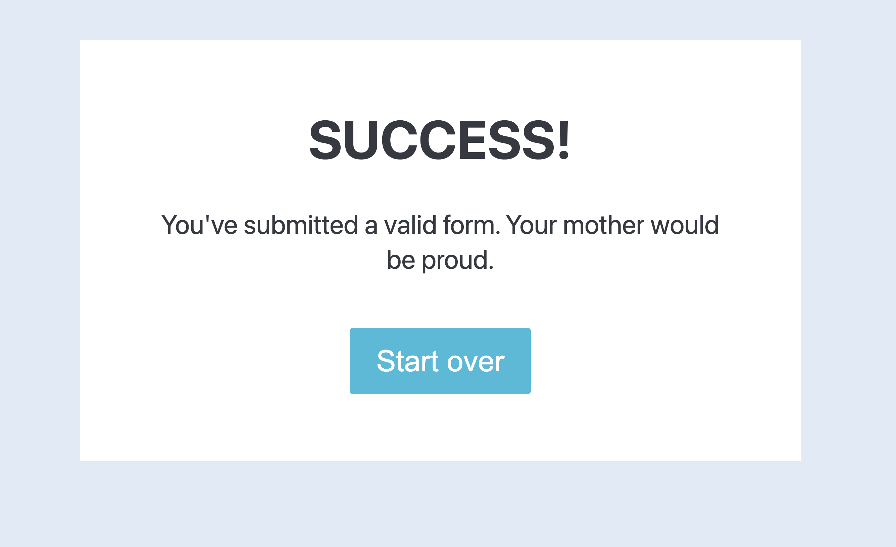

# Ivana Parrilla IS 601 Project 4
Project 4 - Assignment using Hackers and Slackers - Creating your First Flask Application

Generated using this link : https://hackersandslackers.com/your-first-flask-application

I. Creating Your First Flask Application

II. Rendering Pages in Flash Using Jinja

III. Handling Forms. in Flash with Flask-WTF

IV. The ARt of Routing in Flask

V. Configuring Your Flask App

VI. Demystifying Flask's Application Factory

VII. Organizing Flask Apps with Blueprints

VIII. Compiling Frontend JavaScript & Stylesheets Flask

IX. Connect Flask to a Database with Flask-SQLAlchemy

X. Handle User Accounts & Authentication in Flask with Flask-Login

XI. Managing Session Data with Flask Session & Redis

**Screenshots**
Task I: 

Task II:

Task III:

Task IV:

Task V:

Task VI:

Task VI:

Additional Screenshots:

